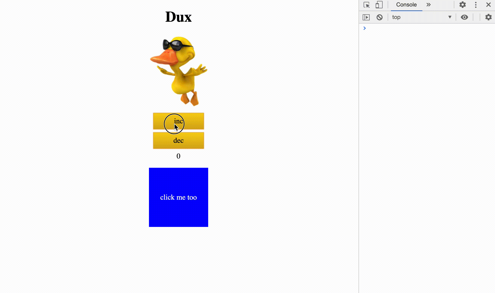

# DUX

Dux is a simpler and more performant version of [Redux](https://redux.js.org). It is simpler to use than [Redux](https://redux.js.org) and easier to understand and tweak.


## Install

Use [npm](https://npmjs.org) to install [dux](https://www.npmjs.com/package/@tpp/dux):

```sh
$ npm install @tpp/dux
```

In javascript:

```javascript
const dux = require(""@tpp/dux")
```

## Usage

A Dux store has a very simple interface:

1. `get()` gets the current value of a field in the state
2. `act()` sends an action to update the fields in the state
3. `react()` is called whenever a particular field is updated

```javascript
/*** Creation ***/
const store = dux.createStore(reducer, initialState)

/*** Getting whole state ***/
let currentstate = store.get()
/*** Reacting to whole state ***/
store.react(() => ....)

/*** Get a particular value ***/
let value = store.get('field')
/*** Getting deep fields ***/
store.get('path.from.0.root.to.field', value => {})

/*** Reacting to only what interests us ***/
store.react('path.from.root.to.field', value => {
  // function is called every time field is updated
})

/*** Actions to change state ***/
store.act(type, payload)
```

## Cleaning Reactions

At some point, we will need to remove reactions. Let’s say we are showing a list of items and an item is removed. So we remove the DOM element corresponding to that item. However the ‘reaction’ that pointed to that DOM element still exists and will prevent that element from being garbage collected.

If you have a few elements, of course, you can choose to ignore this small leak. However it is good practice to clean up after yourself and so you can tell `dux` you no longer need that reaction by calling the `unreact()` method.

Another scenario to consider - say you display a “page” of data and want to navigate to another “page”. Instead of simply hiding the first page you may want to completely destroy it. Again you can inform `dux` that any reactions on that page aren’t needed anymore. The best way to do this is to create a `fork` of the store for the page and then simply `destroy` the fork.

In summary to clean reactions you can use:

1. `unreact()` which will remove the reaction, or 
2. `fork()`  the store and `destroy()` the fork to remove all reactions associated with it

## Samples

```javascript
const store = dux.createStore(reducer, {
  counter: 0,
})

/* dump the entire state on any change */
store.react(() => console.log(store.get()))

/* increment button */
let inc = document.getElementById('inc')
inc.onclick = () => store.act('counter/set', store.get('counter') + 1)

/* decrement button */
let dec = document.getElementById('dec')
dec.onclick = () => store.act('counter/set', store.get('counter') - 1)

/* react to counter changes */
let counterDisp = document.getElementById('counter')
store.react('counter', counter => {
  counterDisp.innerText = counter
})

function reducer(state, type, payload) {
  return {
    counter: reduceCounter(state.counter, type, payload),
  }
}
function reduceCounter(counter, type, payload) {
  switch(type) {
    case 'counter/set': return payload
    default: return counter
  }
}
```

You can see this in action along with a little more functionality in:

* [sample.html](./sample.html)
* [sample2.html](./sample2.html) (multi-colors blocks)
* [sample3.html](./sample3.html) (uses `fork()` and can handle millions of blocks)

See [sample3.html](./sample3.html) in action here



Note that reacting to a million `DOM` elements takes a little time. However, most of the time is spend in the browser’s rendering and when we resize back down to 5000 elements the page again responds immediately.

----

